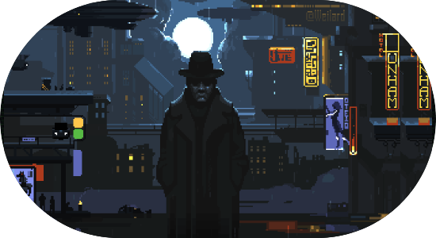

<table style="border: none;">
  <tr>
    <td></td>
    <td>
      
      </a>
       
  &nbsp;<b>About me</b>
       
  

    </td>
  </tr>
</table>

## 🧑‍💻[Languages]

    
 

 
## 🤖 [Technologies]
   

## 📊 GitHub Stats:

  

     
  

   
  

<!-- Proudly created with GPRM ( https://gprm.itsvg.in ) -->

<!--🦶FOOTER--> 

<!--
**NobodyyOn/NobodyyOn** is a ✨ _special_ ✨ repository because its `README.md` (this file) appears on your GitHub profile.

Here are some ideas to get you started:

- 🔭 I’m currently working on ...
- 🌱 I’m currently learning ...
- 👯 I’m looking to collaborate on ...
- 🤔 I’m looking for help with ...
- 💬 Ask me about ...
- 📫 How to reach me: ...
- 😄 Pronouns: ...
- ⚡ Fun fact: ...
-->
